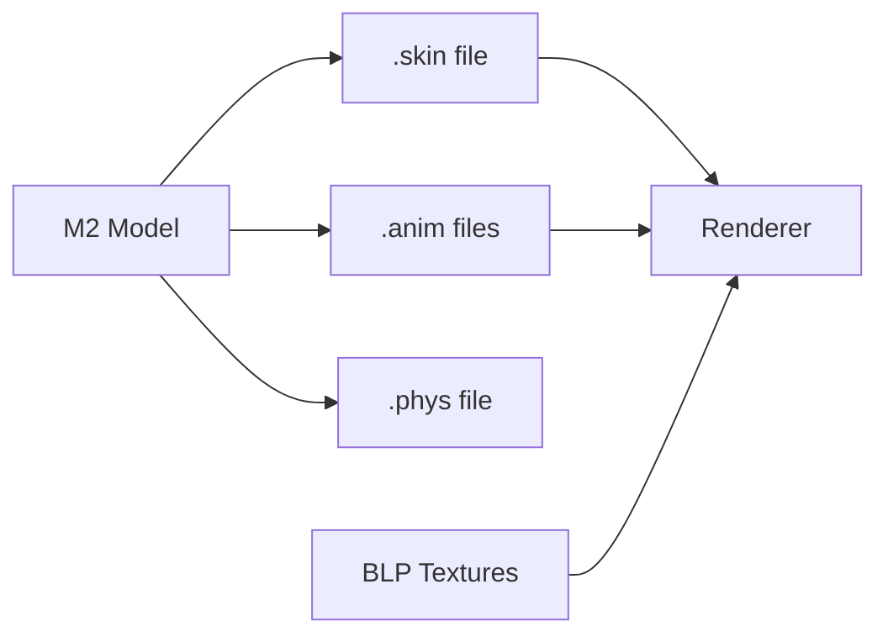

# Graphics and Model Formats

Graphics formats handle textures, 3D models, animations, and visual effects.

## Supported Formats

### [BLP Format](blp.md)

**Blizzard Picture** - Texture format with advanced compression.

- DXT1/3/5 compression
- Uncompressed RGBA
- Built-in mipmaps
- Alpha channel support

### [M2 Format](m2.md)

**Model Version 2** - Animated 3D models for characters, creatures, and objects.

- Skeletal animation
- Particle effects
- Ribbon emitters
- Billboard attachments
- Multiple texture units

#### M2 Sub-formats

- [.anim](m2-anim.md) - External animation sequences
- [.skin](m2-skin.md) - Mesh and LOD data
- [.phys](m2-phys.md) - Physics simulation data

### [WMO Format](wmo.md)

**World Map Object** - Large static structures like buildings and dungeons.

- Portal-based rendering
- Multiple groups (rooms)
- Lightmaps and vertex colors
- Collision geometry
- Liquid volumes

## Model Pipeline



## Common Patterns

### Loading a Character Model

```rust
use warcraft_rs::{M2, M2Skin, Blp};

// Load base model
let model = M2::open("Character/Human/Male/HumanMale.m2")?;

// Load skin (mesh data)
let skin = M2Skin::open("Character/Human/Male/HumanMale00.skin")?;

// Load textures
for texture_id in model.texture_ids() {
    let texture = Blp::open(&texture_id)?;
}
```

### Rendering a Building

```rust
use warcraft_rs::{Wmo, WmoGroup};

// Load root WMO
let wmo = Wmo::open("World/wmo/Azeroth/Buildings/Stormwind/Stormwind.wmo")?;

// Load groups (rooms)
for i in 0..wmo.group_count() {
    let group = WmoGroup::open(&format!("Stormwind_{:03}.wmo", i))?;
}
```

## Texture Management

### Texture Types

- **Diffuse**: Base color texture
- **Normal**: Bump mapping
- **Specular**: Shininess map
- **Environment**: Reflection mapping
- **Glow**: Self-illumination

### Loading Textures

```rust
use warcraft_rs::Blp;

let blp = Blp::open("Textures/Armor/Leather_A_01.blp")?;

// Get raw pixel data
let pixels = blp.get_rgba(0)?; // Mipmap level 0

// Convert to your renderer's format
let texture = create_texture(blp.width(), blp.height(), &pixels);
```

## Animation System

M2 models use a keyframe-based animation system:

```rust
// Play an animation
let anim = model.get_animation("Stand")?;
for frame in 0..anim.duration() {
    let transforms = model.calculate_bones(anim, frame);
    // Apply to mesh
}
```

## Performance Tips

1. **Texture Atlasing**: Combine small textures
2. **LOD System**: Use lower detail models at distance
3. **Instancing**: Batch render identical models
4. **Culling**: Skip hidden WMO groups
5. **Animation Caching**: Pre-calculate bone matrices

## See Also

- [Loading M2 Models Guide](../../guides/m2-models.md)
- [Texture Pipeline](../../guides/texture-pipeline.md)
- [WMO Rendering](../../guides/wmo-rendering.md)
