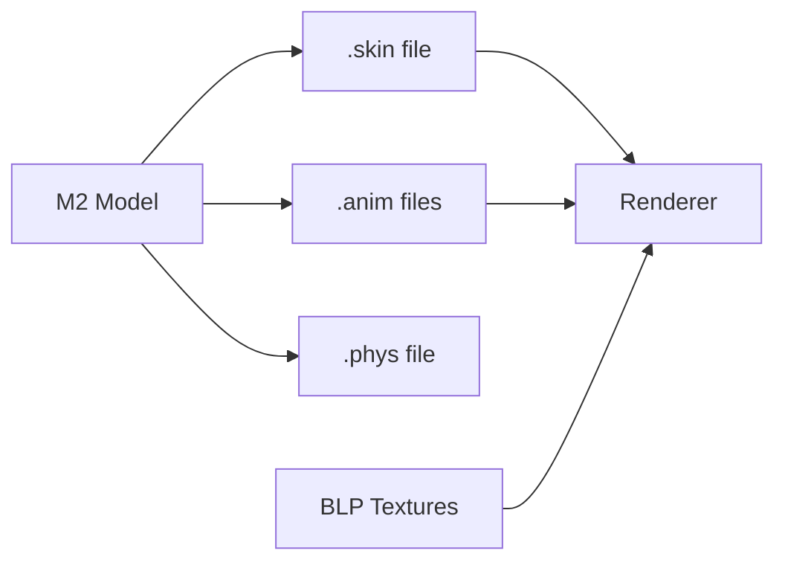

# Graphics and Model Formats

Graphics formats handle textures, 3D models, animations, and visual effects.

## Supported Formats

### [BLP Format](blp.md)

**Blizzard Picture** - Texture format with advanced compression.

- DXT1/3/5 compression
- Uncompressed RGBA
- Built-in mipmaps
- Alpha channel support

### [M2 Format](m2.md)

**Model Version 2** - Animated 3D models for characters, creatures, and objects.

- Skeletal animation
- Particle effects
- Ribbon emitters
- Billboard attachments
- Multiple texture units

#### M2 Sub-formats

- [.anim](m2-anim.md) - External animation sequences
- [.skin](m2-skin.md) - Mesh and LOD data
- [.phys](m2-phys.md) - Physics simulation data

### [WMO Format](wmo.md)

**World Map Object** - Large static structures like buildings and dungeons.

- Portal-based rendering
- Multiple groups (rooms)
- Lightmaps and vertex colors
- Collision geometry
- Liquid volumes

## Model Pipeline



## Common Patterns

### Loading a Character Model

```rust
use wow_m2::{parse_m2, parse_skin};
use wow_blp::parser::load_blp;

// Load base model
let data = std::fs::read("Character/Human/Male/HumanMale.m2")?;
let format = parse_m2(&mut std::io::Cursor::new(data))?;
let model = format.model();

// Load skin (mesh data)
let skin_data = std::fs::read("Character/Human/Male/HumanMale00.skin")?;
let skin = parse_skin(&mut std::io::Cursor::new(skin_data))?;

// Load textures
let texture = load_blp("Character/Human/Male/HumanMaleSkin00.blp")?;
```

### Loading a Building

```rust
use wow_wmo::api::parse_wmo;

// Load root WMO
let data = std::fs::read("World/wmo/Azeroth/Buildings/Stormwind/Stormwind.wmo")?;
let wmo = parse_wmo(&mut std::io::Cursor::new(data))?;
```

## Texture Management

### Texture Types

- **Diffuse**: Base color texture
- **Normal**: Bump mapping
- **Specular**: Shininess map
- **Environment**: Reflection mapping
- **Glow**: Self-illumination

### Loading Textures

```rust
use wow_blp::parser::load_blp;
use wow_blp::convert::blp_to_image;

let blp = load_blp("Textures/Armor/Leather_A_01.blp")?;

// Convert to standard image format
let image = blp_to_image(&blp, 0)?; // Mipmap level 0
image.save("output.png")?;
```

## Performance Tips

1. **Texture Atlasing**: Combine small textures
2. **LOD System**: Use lower detail models at distance
3. **Instancing**: Batch render identical models
4. **Culling**: Skip hidden WMO groups
5. **Animation Caching**: Pre-calculate bone matrices

## See Also

- [Loading M2 Models Guide](../../guides/m2-models.md)
- [Texture Loading](../../guides/texture-loading.md)
- [WMO Rendering](../../guides/wmo-rendering.md)
